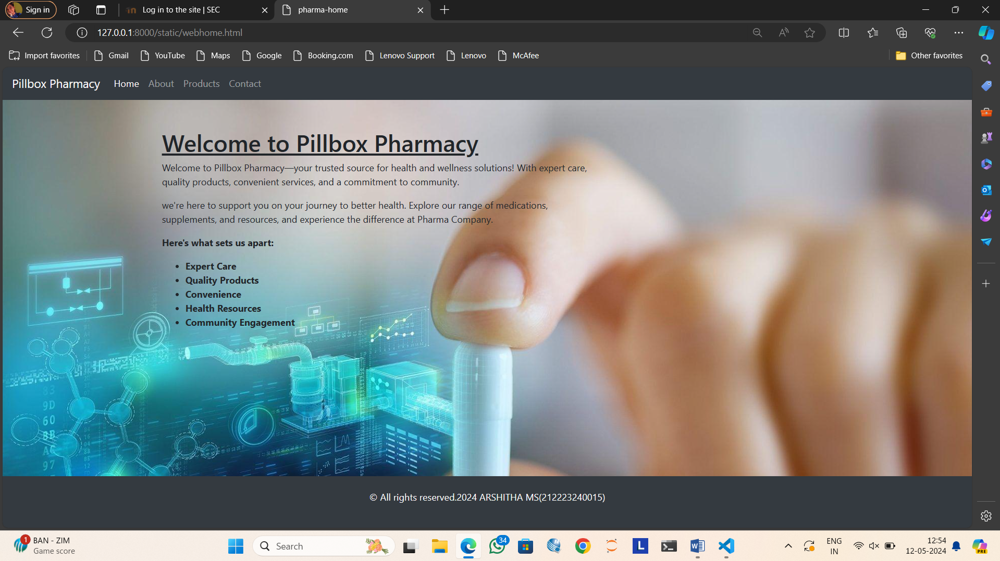

# Project Responsive Web Design using Bootstrap
## Date:

## AIM:
To design a responsive website for a Pharmaceutical Company using Bootstrap.


## DESIGN STEPS:

### Step 1:
Clone the repository from GitHub.

### Step 2:
Create Django Admin project.

### Step 3:
Create a New App under the Django Admin project.

### Step 4:
Insert the necessary CSS and JavaScript files as external in order to use Bootstrap.

### Step 5:
Create a HTML file and include the needed Bootstrap components.

### Step 6:
Publish the website in the LocalHost.

## PROGRAM :
#### webhome.html:
```

<!DOCTYPE html>
<html lang="en">
<head>
  <meta charset="UTF-8">
  <meta name="viewport" content="width=device-width, initial-scale=1.0">
  <title>pharma-home</title>
  <!-- Bootstrap CSS -->
  <link href="https://stackpath.bootstrapcdn.com/bootstrap/4.5.2/css/bootstrap.min.css" rel="stylesheet">
  <!-- Custom CSS -->
  <style>
    body {
      background-image: url('bg3.jpg');
      background-size: cover;
      background-repeat: no-repeat;
    }
    footer{
      position: fixed;
      left: 0;
      bottom: 0;
      width: 100%;
      background-color: #283331; 
      color: white;
      text-align: center;
      padding: 10px 0; 
    }
  </style>
</head>
<body>

  <!-- Navbar -->
  <nav class="navbar navbar-expand-lg navbar-dark bg-dark">
    <a class="navbar-brand" href="#">Pillbox Pharmacy</a>
    <button class="navbar-toggler" type="button" data-toggle="collapse" data-target="#navbarSupportedContent" aria-controls="navbarSupportedContent" aria-expanded="false" aria-label="Toggle navigation">
      <span class="navbar-toggler-icon"></span>
    </button>

    <div class="collapse navbar-collapse" id="navbarSupportedContent">
      <ul class="navbar-nav mr-auto">
        <li class="nav-item active">
          <a class="nav-link" href="webhome.html">Home <span class="sr-only">(current)</span></a>
        </li>
        <li class="nav-item">
          <a class="nav-link" href="about.html">About</a>
        </li>
        <li class="nav-item">
          <a class="nav-link" href="product.html">Products</a>
        </li>
        <li class="nav-item">
          <a class="nav-link" href="contact.html">Contact</a>
        </li>
      </ul>
      
    </div>
  </nav>

  <!-- Page Content -->
  <div class="container mt-5">
    <div class="row">
      <div class="col-md-8">
        <h1><u>Welcome to Pillbox Pharmacy</u></h1>
        <p>Welcome to Pillbox Pharmacy—your trusted source for health and wellness solutions! With expert care, quality products, convenient services, and a commitment to community.</p>
        <p>we're here to support you on your journey to better health. Explore our range of medications, supplements, and resources, and experience the difference at Pharma Company.</p>
        <p><strong>Here's what sets us apart:</strong></p>
        <strong>
        <ul>
          <li>Expert Care</li>
          <li>Quality Products</li>
          <li>Convenience</li>
          <li>Health Resources</li>
          <li>Community Engagement</li>
        </ul>
      </strong>
      </div>
      
    </div>
  </div>

  <!-- Footer -->
  <footer class="bg-dark text-white text-center py-4 mt-5">
    <p>&copy; All rights reserved.2024 ARSHITHA MS(212223240015)</p>
  </footer>

  <!-- Bootstrap JS -->
  <script src="https://code.jquery.com/jquery-3.5.1.slim.min.js"></script>
  <script src="https://cdn.jsdelivr.net/npm/popper.js@1.16.1/dist/umd/popper.min.js"></script>
  <script src="https://stackpath.bootstrapcdn.com/bootstrap/4.5.2/js/bootstrap.min.js"></script>
</body>
</html>
```
#### about.html
```


<!DOCTYPE html>
<html lang="en">
<head>
  <meta charset="UTF-8">
  <meta name="viewport" content="width=device-width, initial-scale=1.0">
  <title>About PharmaCompany</title>
  <!-- Bootstrap CSS -->
  <link href="https://stackpath.bootstrapcdn.com/bootstrap/4.5.2/css/bootstrap.min.css" rel="stylesheet">
  <!-- Custom CSS -->
  <style>
    body {
      background-image: url('bg4.jpg');
      background-size: cover;
      background-repeat: no-repeat;
    }
    footer{
    position: fixed;
      left: 0;
      bottom: 0;
      width: 100%;
      background-color: #343a40; 
      color: white;
      text-align: center;
      padding: 10px 0; 
    }
  </style>
</head>
<body>

  <!-- Navbar -->
  <nav class="navbar navbar-expand-lg navbar-dark bg-dark">
    <a class="navbar-brand" href="#">Pillbox Pharmacy</a>
    <button class="navbar-toggler" type="button" data-toggle="collapse" data-target="#navbarSupportedContent" aria-controls="navbarSupportedContent" aria-expanded="false" aria-label="Toggle navigation">
      <span class="navbar-toggler-icon"></span>
    </button>

    <div class="collapse navbar-collapse" id="navbarSupportedContent">
      <ul class="navbar-nav mr-auto">
        <li class="nav-item">
          <a class="nav-link" href="webhome.html">Home</a>
        </li>
        <li class="nav-item dropdown active">
          <a class="nav-link dropdown-toggle" href="about.html" id="navbarDropdownAbout" role="button" data-toggle="dropdown" aria-haspopup="true" aria-expanded="false">
            About
          </a>
          <div class="dropdown-menu" aria-labelledby="navbarDropdownAbout">
            <a class="dropdown-item" href="#vision">Vision</a>
            <a class="dropdown-item" href="#mission">Mission</a>
            <a class="dropdown-item" href="#values">Values</a>
            <!-- Add more subheadings as needed -->
          </div>
        </li>
        <li class="nav-item">
          <a class="nav-link" href="product.html">Products</a>
        </li>
        <li class="nav-item">
          <a class="nav-link" href="#">Contact</a>
        </li>
      </ul>
    </div>
  </nav>

  <!-- Page Content -->
  <div class="container mt-5">
    <div class="row">
      <div class="col-md-12">
        <h1>About Pillbox Pharmacy</h1>
        <p>
        Our mission at PillBox is to provide outstanding pharmacy services that revolve around<br>
        personalized care and cost-effective solutions. As an independent long-term care pharmacy,
        <br> we are dedicated to meeting your pharmacy needs through tailored expertise, an
        <br> extensive range of medications, comprehensive infusion therapy, and advanced digital tools.<p>
        <!-- Add more subheadings as needed -->
      </div>
    </div>
  </div>

  <!-- Footer -->
  <footer class="bg-dark text-white text-center py-4 mt-5">
    <p>&copy;All rights reserved.2024 ARSHITHA MS(212223240015)</p>
  </footer>

  <!-- Bootstrap JS -->
  <script src="https://code.jquery.com/jquery-3.5.1.slim.min.js"></script>
  <script src="https://cdn.jsdelivr.net/npm/popper.js@1.16.1/dist/umd/popper.min.js"></script>
  <script src="https://stackpath.bootstrapcdn.com/bootstrap/4.5.2/js/bootstrap.min.js"></script>
</body>
</html>
```
#### product.html
```


<!DOCTYPE html>
<html lang="en">
<head>
  <meta charset="UTF-8">
  <meta name="viewport" content="width=device-width, initial-scale=1.0">
  <title>products</title>
  <!-- Bootstrap CSS -->
  <link href="https://stackpath.bootstrapcdn.com/bootstrap/4.5.2/css/bootstrap.min.css" rel="stylesheet">
  <!-- Custom CSS -->
  <style>
    body {
      background-image: url('bg2new.jpg');
      background-size: cover;
      background-repeat: no-repeat;
    }
    footer{
      position: fixed;
      left: 0;
      bottom: 0;
      width: 100%;
      background-color: #232a2a; 
      color: white;
      text-align: center;
      padding: 10px 0; 
    }
  </style>
</head>
<body>

  <!-- Navbar -->
  <nav class="navbar navbar-expand-lg navbar-dark bg-dark">
    <a class="navbar-brand" href="#">Pillbox Pharmacy</a>
    <button class="navbar-toggler" type="button" data-toggle="collapse" data-target="#navbarSupportedContent" aria-controls="navbarSupportedContent" aria-expanded="false" aria-label="Toggle navigation">
      <span class="navbar-toggler-icon"></span>
    </button>

    <div class="collapse navbar-collapse" id="navbarSupportedContent">
      <ul class="navbar-nav mr-auto">
        <li class="nav-item">
          <a class="nav-link" href="webhome.html">Home</a>
        </li>
        <li class="nav-item">
          <a class="nav-link" href="about.html">About</a>
        </li>
        <li class="nav-item active">
          <a class="nav-link" href="product.html">Products <span class="sr-only">(current)</span></a>
        </li>
        <li class="nav-item">
          <a class="nav-link" href="contact.html">Contact</a>
        </li>
      </ul>
      
    </div>
  </nav>

  <!-- Page Content -->
  <div class="container mt-5">
    <div class="row">
      <div class="col-md-12">
        <h1>Our Best Selling Products!</h1>
        <div class="card-deck">
          <div class="card">
            
            <div class="card-body">
              <h5 class="card-title">Paracetemol</h5>
              <p class="card-text">30 tablets of Paracetemol that acts as a painkiller and fever reducer.</p>
              <a href="#" class="btn btn-primary">Buy Now</a>
            </div>
          </div>
          <div class="card">
            
            <div class="card-body">
              <h5 class="card-title">Amoxicillin</h5>
              <p class="card-text">30 tablets of Amoxicillin to treat bacterial infection</p>
              <a href="#" class="btn btn-primary">Buy Now</a>
            </div>
          </div>
          <div class="card">
            
            <div class="card-body">
              <h5 class="card-title">Aspirin</h5>
              <p class="card-text">50 tablets of aspirin to be used as painkiller.</p>
              <a href="#" class="btn btn-primary">Buy Now</a>
            </div>
          </div>
        </div>
      </div>
    </div>
  </div>

  <!-- Footer -->
  <footer class="bg-dark text-white text-center py-4 mt-5">
    <p>&copy; All rights reserved.2024 ARSHITHA MS(212223240015)</p>
  </footer>

  <!-- Bootstrap JS -->
  <script src="https://code.jquery.com/jquery-3.5.1.slim.min.js"></script>
  <script src="https://cdn.jsdelivr.net/npm/popper.js@1.16.1/dist/umd/popper.min.js"></script>
  <script src="https://stackpath.bootstrapcdn.com/bootstrap/4.5.2/js/bootstrap.min.js"></script>
</body>
</html>
```
#### contact.html
```


<!DOCTYPE html>
<html lang="en">
<head>
  <meta charset="UTF-8">
  <meta name="viewport" content="width=device-width, initial-scale=1.0">
  <title>Contact Us - PharmaCompany</title>
  <!-- Bootstrap CSS -->
  <link href="https://stackpath.bootstrapcdn.com/bootstrap/4.5.2/css/bootstrap.min.css" rel="stylesheet">
  <!-- Custom CSS -->
  <style>
    body {
      background-image: url('medbg.jpg');
      background-size: cover;
      background-repeat: no-repeat;
    }
    footer{
      position: fixed;
      left: 0;
      bottom: 0;
      width: 100%;
      background-color: #343a40; 
      color: white;
      text-align: center;
      padding: 10px 0; 
    }
  </style>
</head>
<body>

  <!-- Navbar -->
  <nav class="navbar navbar-expand-lg navbar-dark bg-dark">
    <a class="navbar-brand" href="#">Pillbox Pharmacy</a>
    <button class="navbar-toggler" type="button" data-toggle="collapse" data-target="#navbarSupportedContent" aria-controls="navbarSupportedContent" aria-expanded="false" aria-label="Toggle navigation">
      <span class="navbar-toggler-icon"></span>
    </button>

    <div class="collapse navbar-collapse" id="navbarSupportedContent">
      <ul class="navbar-nav mr-auto">
        <li class="nav-item">
          <a class="nav-link" href="webhome.html">Home</a>
        </li>
        <li class="nav-item">
          <a class="nav-link" href="about.html">About</a>
        </li>
        <li class="nav-item">
          <a class="nav-link" href="product.html">Products</a>
        </li>
        <li class="nav-item active">
          <a class="nav-link" href="contact.html">Contact <span class="sr-only">(current)</span></a>
        </li>
      </ul>
    </div>
  </nav>

  <!-- Page Content -->
  <div class="container mt-5">
    <div class="row">
      <div class="col-md-8">
        <h1>Contact Us</h1>
        <p>For any inquiries or feedback,contact us!</p>
        <form>
          <div class="form-group">
            <label for="name"><strong>Your Name</strong></label>
            <input type="text" class="form-control" id="name" placeholder="Enter your name">
          </div>
          <div class="form-group">
            <label for="email"><strong>Your Email</strong></label>
            <input type="email" class="form-control" id="email" placeholder="Enter your email">
          </div>
          <div class="form-group">
            <label for="message"><strong>Message</strong></label>
            <textarea class="form-control" id="message" rows="5" placeholder="Enter your message"></textarea>
          </div>
          <button type="submit" class="btn btn-primary">Submit</button>
        </form>
      </div>
      <div class="col-md-4">
        <h2>PharmaCompany</h2>
        <address>
          <strong><u>Address:</u></strong><br>
          Door No.30/1, Kummalamman Koil Street Tondiarpet,<br> Chennai, Tamil Nadu 600081 <br><br>
          <strong><u>Email:</u></strong><br>
          pillboxpharmacy@gmail.com<br>
          <br>
          <strong><u>Phone:</u></strong><br>
          +6468964156
        </address>
      </div>
    </div>
  </div>

  <!-- Footer -->
  <footer class="bg-dark text-white text-center py-4 mt-5">
    <p>&copy; All rights reserved.2024 ARSHITHA MS(212223240015)</p>
  </footer>

  <!-- Bootstrap JS -->
  <script src="https://code.jquery.com/jquery-3.5.1.slim.min.js"></script>
  <script src="https://cdn.jsdelivr.net/npm/popper.js@1.16.1/dist/umd/popper.min.js"></script>
  <script src="https://stackpath.bootstrapcdn.com/bootstrap/4.5.2/js/bootstrap.min.js"></script>
</body>
</html>
```
## OUTPUT:
#### Home page:

#### About page:

#### Products page:

#### Contact page:


## RESULT:
The Project for responsive web design using Bootstrap is completed successfully.
